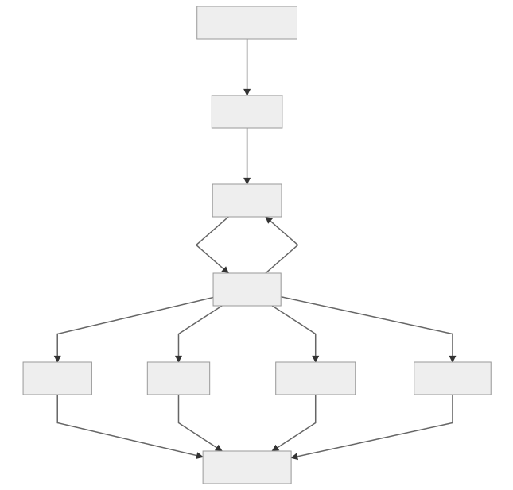

# Sienna Locomotive

Sienna Locomotive is a fuzzing and crash triage platform that aims to make fuzzing accessible to developers with limited security expertise. Its user-oriented features make it easy to configure, easy to run, and easy to interpret the results. For more information, see our [blog post](https://blog.trailofbits.com/user-friendly-fuzzing-with-sienna-locomotive).

## Features
* Target individual function calls for fuzzing instead of entire files
* Automatically triage and deduplicate crashes
* One-button reporting of code coverage and performance stats
* Fully configurable from a GUI
* Supports 64-bit Windows binaries, even without source code

## Getting Started

Watch this [demo video](https://www.youtube.com/watch?v=tSFdLSB1nAA).

Check out the [user manual](./_assets/manual.pdf).

### High level architecture

### Installation

**IMPORTANT**: Sienna Locomotive makes changes to the system it runs on in order to
facilitate its instrumentation. It may require you to disable Windows Error Reporting as it interferes with the triage process. For these reasons, Sienna Locomotive will run best when installed on its own machine (including
virtual machines).

Pre-built binaries are available on the
[releases page](https://github.com/trailofbits/sienna-locomotive/releases). To install from a pre-built binary, extract the zip file, then right-click on install.ps1 and click "Run with Powershell" 

To build Sienna Locomotive for yourself, continue reading.

### Building
First, clone the repository:
`git clone https://github.com/trailofbits/sienna-locomotive.git` (or download a zip)

#### Dependencies

Building SL requires the following:

* Supported Windows 10 Build
    * Windows 1803 is known to work
    * Earlier versions of Windows 10 will probably work
    * [1809 support is pending](https://github.com/DynamoRIO/dynamorio/issues/3391)
* [CMake](https://cmake.org/download/)
* Visual Studio 2017 (Install components for Windows Console dev)
* DynamoRIO (Automatically installed with `make.ps1`)
* Python (3.7+)

#### Build Commands

Compilation, deployment, and cleanup is done via `make.ps1` in Sienna Locomotive's
root directory.

To install DynamoRIO and build the project:

`PS C:\proj\sl2\sienna-locomotive> .\make.ps1`

If any part of the build complains about missing tools or libraries, try running under
the Visual Studio Developer Command Prompt.

To clean the project of build artifacts, run `.\make.ps1 clean`.

Try `make.ps1 help` for more options and information.

#### Internal API Documentation

SL's internals are documented using Doxygen.

If you want to build the doxygen documents.
  1. Install doxygen from http://ftp.stack.nl/pub/users/dimitri/doxygen-1.8.14-setup.exe
  1. `./make.ps1 doc`
  1. Open `doc/html/index.html` in your browser

### Running

#### Via the GUI

Running `sl2` will start the Qt frontend for the fuzzer.

This frontend is the default user interface, and should suffice for most use cases.

#### Via the CLI

For more advanced users, `sl2-cli` can be used to configure and run each SL component individually.

`sl2-cli -h` will print out a listing of all available options.

## Triage

The triage system is a separate executable, `triager.exe` that is run by the harness.  It takes care of ranking exploitability, uniqueness, and binning of crashes.

### Winchecksec

Read the [winchecksec README](https://github.com/trailofbits/winchecksec).

### Exploitability

The Exploitability ranking is a score for the potential ability to exploit a crash based on 3 engines.  The ranks, ranging from High (4) to None (0), in order of likelyhood are:

  * **High** (4): The mostly likely case of a crash being exploitable.
  * **Medium** (3): Between High and Low.
  * **Low** (2): At or above the cutoff for low exploitability.
  * **Unknown** (1): Unknown cases are below the cutoff for low, but still have the potential to be of interest.
  * **None** (0): Very unlikely the crash is exploitable.

#### Engines

  * **Google's Breakpad**: This engine uses Google's Breakpad library, which parses minidump files and return an exploitability between High and None as well.
  * **Microsoft's `!exploitable`**: A reimplementation and approxmiation of the `!exploitable` command for `windbg`, built on top of breakpad.
  * **SL Tracer**: Uses the score from our own SL tracer, which takes taint information into consideration.

## License

Sienna Locomotive is licensed and distributed under the AGPLv3 license. [Contact us](mailto:opensource@trailofbits.com) if you're looking for an exception to the terms.
